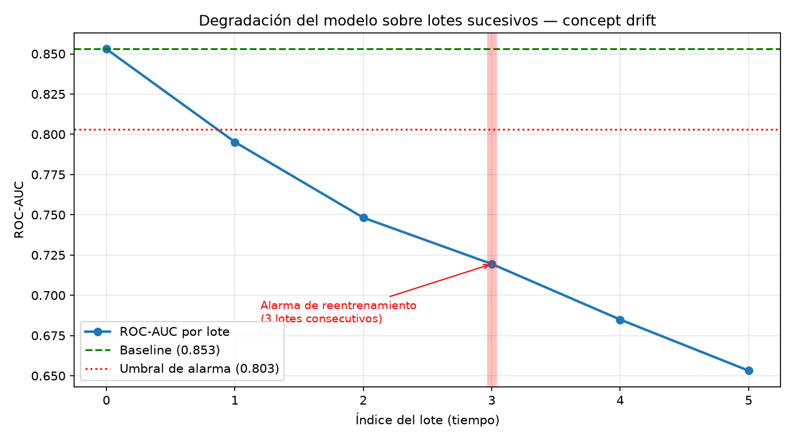

# Evidencias

Salidas de terminal y capturas que respaldan cada requisito del enunciado.
Cada entrada indica quién la produjo y con qué comando, para que sea
reproducible durante la defensa.

**Estado general:** en construcción. Las secciones marcadas *pendiente*
se completan a medida que avanzan los runbooks.

---

## 1. Infraestructura y seguridad (runbook 01 · integrante #5)

### 1.1 DNS de los subdominios

```
$ dig +short churn.juanitodev.com
152.53.167.147
$ dig +short mlflow.juanitodev.com
152.53.167.147
```

Ambos subdominios resuelven a la IP del VPS.

### 1.2 Firewall — política y reglas

```
$ sudo ufw status verbose
Status: active
Logging: on (low)
Default: deny (incoming), allow (outgoing), allow (routed)
New profiles: skip

To                         Action      From
--                         ------      ----
22/tcp (OpenSSH)           ALLOW IN    Anywhere
80,443/tcp (Nginx Full)    ALLOW IN    Anywhere
Anywhere                   ALLOW IN    10.42.0.0/16    # k3s pods
Anywhere                   ALLOW IN    10.43.0.0/16    # k3s services
22/tcp (OpenSSH (v6))      ALLOW IN    Anywhere (v6)
80,443/tcp (Nginx Full (v6)) ALLOW IN  Anywhere (v6)
```

Solo tres puertos abiertos al exterior: 22, 80 y 443. La política de
enrutado es `allow` porque el tráfico entre pods de Kubernetes atraviesa la
cadena `FORWARD`; con el `deny` por defecto de `ufw`, CoreDNS entra en
`CrashLoopBackOff`.

### 1.3 Cierre del puerto 5000 — cadena DOCKER-USER

```
$ sudo iptables -L DOCKER-USER -n --line-numbers
Chain DOCKER-USER (1 references)
num  target     prot opt source               destination
1    RETURN     6    --  127.0.0.1            0.0.0.0/0    tcp dpt:5000
2    RETURN     6    --  10.42.0.0/16         0.0.0.0/0    tcp dpt:5000
3    DROP       6    --  0.0.0.0/0            0.0.0.0/0    tcp dpt:5000
```

Se permite el acceso desde el propio host (nginx) y desde el CIDR de pods de
k3s; se descarta todo lo demás.

### 1.4 Verificación DESDE FUERA del VPS

Esta es la evidencia que convierte «creemos que está cerrado» en «lo hemos
comprobado». Ejecutada desde una máquina externa, no desde el servidor.

**Antes de aplicar la regla — el puerto estaba abierto a internet:**

```
=== Sondeo desde fuera del VPS ===
  ABIERTO   22
  ABIERTO   80
  ABIERTO   443
  ABIERTO   5000     <-- MLflow expuesto
  cerrado   30080
  cerrado   5432

$ curl -s http://152.53.167.147:5000/health
OK
```

**Después de aplicar la regla:**

```
=== Sondeo desde fuera del VPS — 2026-08-04 20:39:37 ===
  ABIERTO   22
  ABIERTO   80
  ABIERTO   443
  cerrado   5000
  cerrado   30080
  cerrado   5432

$ curl -s -m 8 http://152.53.167.147:5000/health
  (sin respuesta)
```

**Por qué `ufw` no bastaba.** Docker inserta sus propias reglas de iptables y
las publicaciones de puertos se saltan `ufw` por completo: `ufw` filtra en la
cadena `INPUT`, mientras que el tráfico DNAT-eado hacia un contenedor pasa por
`FORWARD`. La cadena `DOCKER-USER` sí se evalúa en esa ruta.

---

## 2. MLflow y trazabilidad (fase 1)

### 2.1 Los seis runs registrados

Ejecutados contra el servidor real por HTTPS con autenticación:

```
$ export MLFLOW_TRACKING_URI=https://mlflow.juanitodev.com
$ python -m src.train

Experimento 'telco-churn-experimento' · entrenamiento=5634 filas · prueba=1409 filas

logreg-C0.1    roc_auc=0.8409 f1=0.5913 recall=0.5455
logreg-C1.0    roc_auc=0.8420 f1=0.6040 recall=0.5588
rf-100-d5      roc_auc=0.8400 f1=0.5301 recall=0.4358
rf-300-d10     roc_auc=0.8415 f1=0.5762 recall=0.5107
gb-lr0.05      roc_auc=0.8452 f1=0.5793 recall=0.5080
gb-lr0.2       roc_auc=0.8386 f1=0.5663 recall=0.5027

6 runs registrados en https://mlflow.juanitodev.com
```

Son seis, por encima del mínimo de cinco que exige el enunciado, y comparables
entre sí: comparten split, semilla y conjunto de métricas.

### 2.2 Model Registry — dos versiones y alias

```
$ python -m src.register

Created version '1' of model 'telco-churn'.
Created version '2' of model 'telco-churn'.
v1 = linea base logistica  roc_auc=0.8420
Alias 'champion' -> telco-churn v2
v2 = champion            roc_auc=0.8452
```

### 2.3 Trazabilidad — el modelo desplegado y su experimento

```
$ python -c "from src.register import champion_info; print(champion_info())"

  model_name: telco-churn
  version:    2
  run_id:     140470a3690b4e37829cb13bc23ece0b
  alias:      champion
```

Ese `run_id` corresponde al run `gb-lr0.05` del experimento, visible en
`https://mlflow.juanitodev.com/#/experiments/1/runs/140470a3690b4e37829cb13bc23ece0b`,
y es el mismo que devuelve el endpoint `/model-info` del servicio en
Kubernetes. **Ese vínculo es la trazabilidad que exige §3.3 del enunciado.**

### 2.4 El modelo se carga por alias, no por ruta

```
$ python -c "import mlflow; mlflow.sklearn.load_model('models:/telco-churn@champion')"

Modelo descargado del registry en 6.1s
Pipeline: preprocessor -> classifier

Predicciones de prueba:
   cliente 1: 0.0435 de probabilidad de abandono
   cliente 2: 0.7622 de probabilidad de abandono
   cliente 3: 0.0651 de probabilidad de abandono

ROC-AUC sobre el test completo: 0.8452
```

El pipeline descargado incluye el paso `preprocessor`: el preprocesamiento
viaja **dentro** del modelo, así que el servicio de inferencia no lo
reimplementa. Es lo que descarta el train/serve skew.

---

## 3. Contenerización (fase 2)

La imagen `telco-churn-api:v1` se construye con un `Dockerfile` propio
(multi-stage, `python:3.12-slim`, usuario no-root) y se importa a containerd:

```
$ docker build -t telco-churn-api:v1 .
$ docker save telco-churn-api:v1 | sudo k3s ctr images import -
$ sudo k3s ctr images ls | grep telco-churn
docker.io/library/telco-churn-api:v1
```

El contenedor levanta el servicio y responde inferencias **sin pasos manuales
adicionales**: el `CMD` arranca uvicorn y el modelo se descarga del registry
durante el `startup` de la aplicación.

---

## 4. Kubernetes (fase 3)

### 4.1 Demostración 1 — Tres réplicas en Running simultáneo

```
$ kubectl get pods -o wide
NAME                               READY   STATUS    RESTARTS   AGE   IP           NODE
telco-churn-api-5fd68dcc67-f8rlp   1/1     Running   0          46s   10.42.0.8    creativadev
telco-churn-api-5fd68dcc67-m9zsd   1/1     Running   0          46s   10.42.0.9    creativadev
telco-churn-api-5fd68dcc67-xjstb   1/1     Running   0          46s   10.42.0.10   creativadev
```

Tres pods `Running` con `READY 1/1`, cada uno con su IP en la red del clúster.

### 4.2 Trazabilidad del modelo desplegado

```
$ curl -s http://localhost:30080/model-info
{"model_name":"telco-churn","version":"2",
 "run_id":"140470a3690b4e37829cb13bc23ece0b",
 "alias":"champion","loaded_at":"2026-08-05T04:27:44.583970+00:00"}

$ curl -s https://churn.juanitodev.com/model-info
{"model_name":"telco-churn","version":"2",
 "run_id":"140470a3690b4e37829cb13bc23ece0b",
 "alias":"champion","loaded_at":"2026-08-05T04:27:44.583970+00:00"}
```

Ese `run_id` es **el mismo** que el del run `gb-lr0.05` del experimento
(§2.3). El modelo que está sirviendo peticiones en Kubernetes y el
experimento que lo produjo están vinculados de forma verificable.

### 4.3 Demostración 2 — El tráfico se distribuye entre réplicas

Ejecutado **desde una máquina externa**, contra la URL pública por HTTPS:

```
$ ./scripts/demo_balanceo.sh https://churn.juanitodev.com 12

Enviando 12 peticiones a https://churn.juanitodev.com/predict

   1  telco-churn-api-5fd68dcc67-xjstb p=0.5799
   2  telco-churn-api-5fd68dcc67-xjstb p=0.5799
   3  telco-churn-api-5fd68dcc67-m9zsd p=0.5799
   4  telco-churn-api-5fd68dcc67-f8rlp p=0.5799
   5  telco-churn-api-5fd68dcc67-m9zsd p=0.5799
   6  telco-churn-api-5fd68dcc67-f8rlp p=0.5799
   7  telco-churn-api-5fd68dcc67-m9zsd p=0.5799
   8  telco-churn-api-5fd68dcc67-f8rlp p=0.5799
   9  telco-churn-api-5fd68dcc67-m9zsd p=0.5799
  10  telco-churn-api-5fd68dcc67-f8rlp p=0.5799
  11  telco-churn-api-5fd68dcc67-m9zsd p=0.5799
  12  telco-churn-api-5fd68dcc67-f8rlp p=0.5799

Reparto entre pods:
    5 peticiones  telco-churn-api-5fd68dcc67-f8rlp
    5 peticiones  telco-churn-api-5fd68dcc67-m9zsd
    2 peticiones  telco-churn-api-5fd68dcc67-xjstb

BALANCEO DEMOSTRADO: 3 pods distintos atendieron las peticiones.
```

**Dos cosas que muestra esta salida.** Primero, el reparto real entre las tres
réplicas: cada pod conoce su nombre por la Downward API y lo devuelve en
`served_by`. Segundo, la probabilidad es **idéntica en los tres pods**
(`0.5799`), lo que confirma que todos sirven exactamente la misma versión del
modelo — no hay réplicas descompasadas.

El reparto no es perfectamente uniforme porque `kube-proxy` balancea con
reglas de iptables de probabilidad, no con un reparto por turnos estricto.

### 4.4 Demostración 3 — Autorreparación

*Pendiente:* borrar un pod con tráfico en curso y comprobar que ninguna
petición falla.

### 4.5 Demostración 4 — Escalado

*Pendiente:* `kubectl scale` a 5 y a 2 réplicas.

---

## 5. Detección de drift (fase 4)

### 5.1 Suite de tests — completamente en verde

```
$ pytest -q
81 passed in 135.57s
```

La suite verifica que los detectores funcionan, incluidas las fórmulas de PSI
y Cramér's V contra valores calculados a mano.

### 5.2 Puerta de drift — verde con datos limpios, roja con datos derivados

```
$ python -m drift.check --batch data/batches/lote_0.csv
VERDE — sin deriva significativa
exit=0

$ python -m drift.check --batch data/batches/lote_3.csv
ROJO — deriva detectada en 2 variable(s): Contract, MonthlyCharges
exit=1
```

Es el comportamiento que exige §6.1 del enunciado: pasa con datos del mismo
origen que el entrenamiento y falla cuando se inyecta deriva deliberadamente.

### 5.3 Concept drift y criterio de reentrenamiento

Medido con el modelo real descargado del registry (`telco-churn` v2):

```
$ python -m drift.monitor

Baseline (lote 0): 0.8530
  Lote 0: ROC-AUC=0.8530  caída=+0.0000
  Lote 1: ROC-AUC=0.7952  caída=+0.0578  <-- por debajo del umbral
  Lote 2: ROC-AUC=0.7482  caída=+0.1048  <-- por debajo del umbral
  Lote 3: ROC-AUC=0.7195  caída=+0.1335  <-- por debajo del umbral
  Lote 4: ROC-AUC=0.6849  caída=+0.1681  <-- por debajo del umbral
  Lote 5: ROC-AUC=0.6532  caída=+0.1998  <-- por debajo del umbral

ALARMA: procede reentrenar (lote 3)
```



**Cómo leer la gráfica.** El ROC-AUC cae de 0,853 a 0,653 conforme aumenta la
proporción de etiquetas invertidas. La línea roja punteada marca el umbral de
alarma (baseline menos 0,05). La alarma **no se dispara en el lote 1**, aunque
ya está por debajo del umbral, sino en el **lote 3**: el criterio exige que la
caída se sostenga durante tres lotes consecutivos, para no reentrenar por un
lote ruidoso.

Nótese que las variables de entrada no se alteraron en los lotes 1 y 2: solo
cambió la relación entrada-salida. Es exactamente lo que distingue el concept
drift del data drift, y por qué el monitoreo de entradas por sí solo no
bastaría para detectarlo.

---

## 6. TLS y exposición pública

*Pendiente:* certificados válidos en ambos subdominios, redirección 80→443,
`certbot renew --dry-run` y respuesta 401 de MLflow sin credenciales.

---

## 7. Puntos extra — UI web

*Pendiente:* captura de la interfaz ejecutando predicciones reales contra
`https://churn.juanitodev.com`, mostrando el cambio de `served_by` entre pods.
